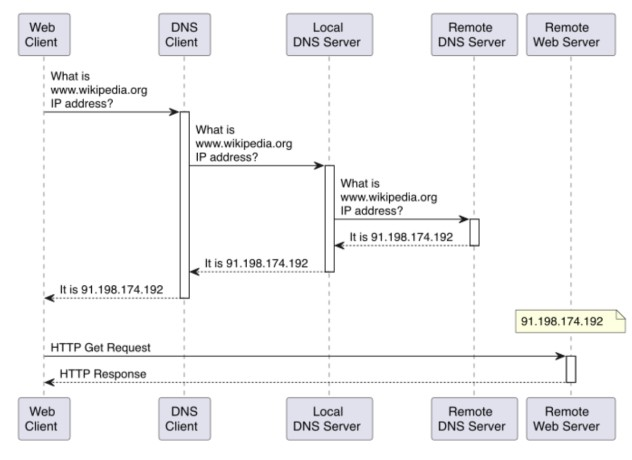
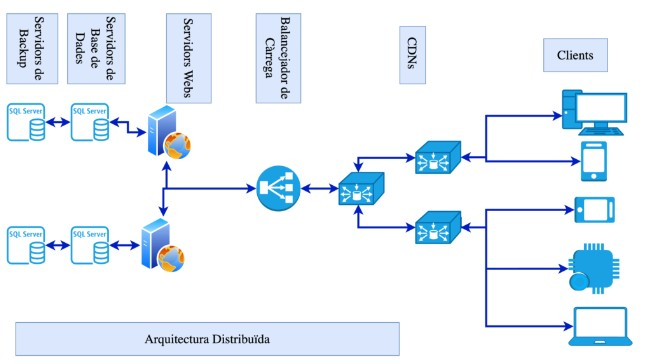

# AMSA - Setmana 1: La feina de l’administrador de sistemes
**Nom:** Nel Banqué Torné

## Resum teòric
Els administradors de sistemes són persones amb coneixement tècnic que s’anticipen o resolen problemes sota pressió. Han de tenir la capacitat d'enfrontar-se a qualsevol problema que pugui succeir.

#### Feines a destacar d’aquest àmbit:
- **Site Reliability Engineer**: enginyers dedicats a mantenir els sistemes actius i prevenir errors (Google els va anomenar així).
- **DevOps Engineer**: enginyers dedicats a accelerar el desplegament d’aplicacions, millorar la qualitat del programari i optimitzar fluxos de treball.

### Arquitectura de servidors
- **Arquitectura Client-Servidor**: arquitectura que involucra serveis i servidors que processen i responen peticions. Centralitza les dades en un lloc, però podem tenir atacs que s’han de prevenir.

    

- **Arquitectura escalable**: arquitectura amb mínim dos servidors separats amb còpies per evitar problemes i amb balancejador de càrrega. Però podem tenir diversos problemes si no es protegeix bé la informació o si no es dissenya bé o no està ben assegurat.

    

- Un centre de dades és un espai que allotja un conjunt de servidors i equipaments de xarxa per proporcionar recursos informàtics.
- Un rack és una estructura que allotja servidors, switches, routers i altres dispositius.
- Un switch és un dispositiu de xarxa que connecta diversos equips informàtics.

### Disseny de sistemes informàtics
Un bon disseny de sistemes informàtics ha de tenir:

- **Escalabilitat**: és la capacitat d’un sistema per gestionar un augment de la càrrega de treball sense afectar el rendiment.

- **Fiabilitat**: és la capacitat per operar sense interrupcions durant un període determinat.

- **Disponibilitat**: és la capacitat per estar operatiu i accessible per als usuaris durant un període de temps determinat.

- **KiSS**: *Keep It Simple, Stupid*: un sistema simple és més fàcil de mantenir, gestionar i entendre.

### Cloud computing
És el lliurament de recursos sota demanda, incloent-hi servidors, emmagatzematge, bases de dades, programari, analítica i més, a través d’internet amb un model de pagament per ús.

## Exemples pràctics
Podem relacionar un administrador de sistemes amb la frase: més val prevenir que curar. Però en cas de problema, cal actuar ràpidament.

Exemples d’arquitectura Client-Servidor: servidor de fitxers, servidor web, servidor de base de dades.

## Dubtes, preguntes i aspectes interessants
Si caiem en un atac de phishing, cal desconnectar ràpidament la xarxa.

## Reflexió personal
He après que la feina d’un administrador de sistemes va més enllà de la part tècnica: és sobretot anticipar-se als problemes i saber reaccionar amb calma quan passen. També m’ha fet adonar-me de la importància de tenir les coses ben organitzades i senzilles, perquè així és més fàcil de controlar i mantenir.
 
