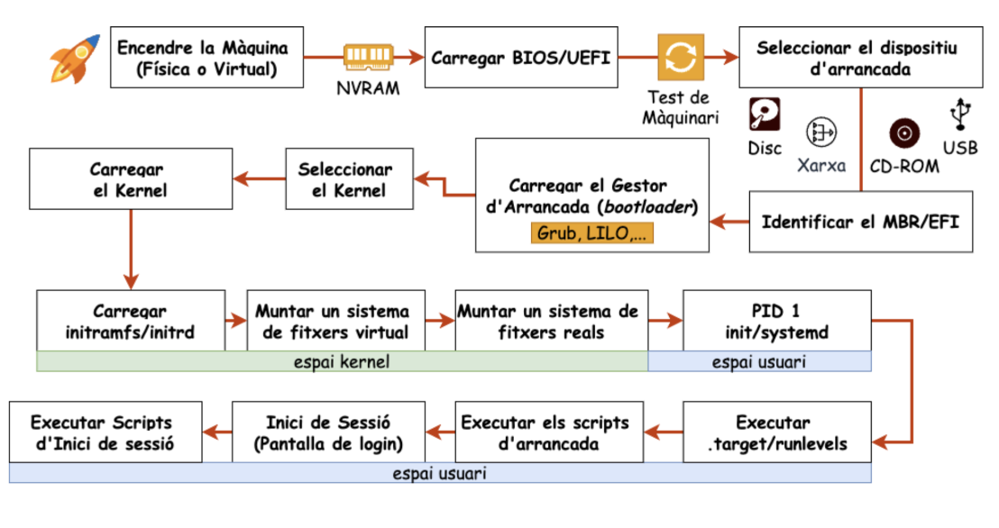
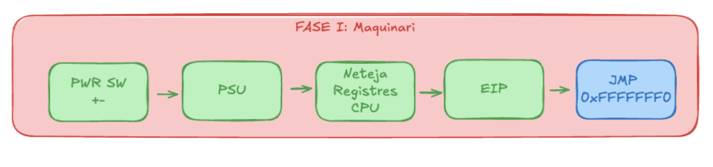
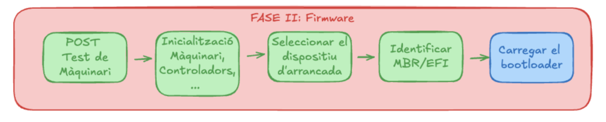
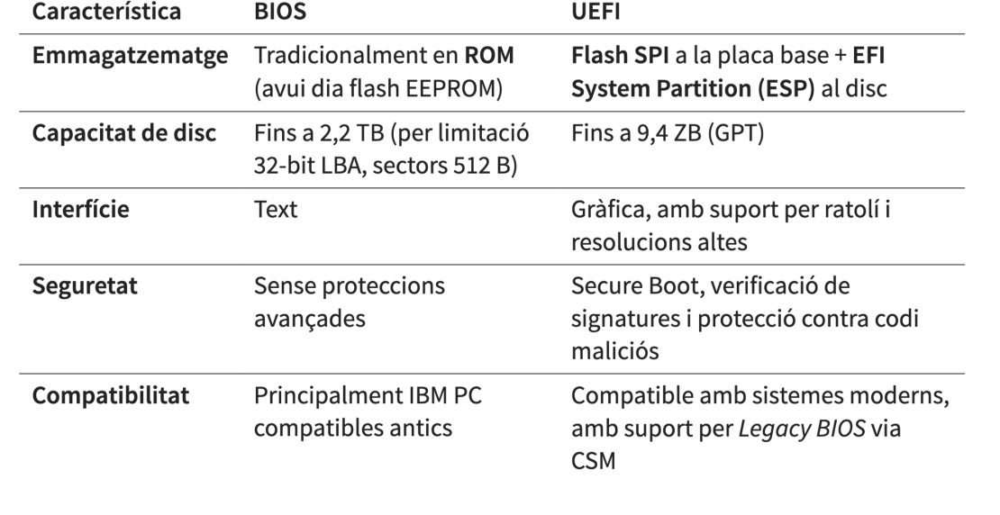
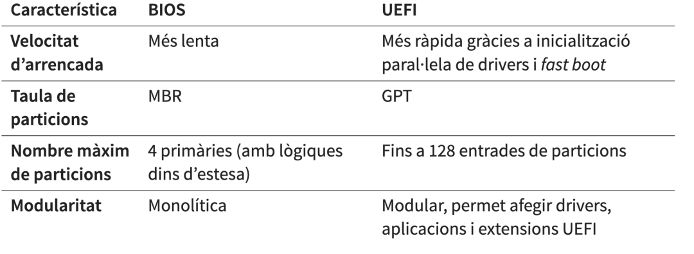
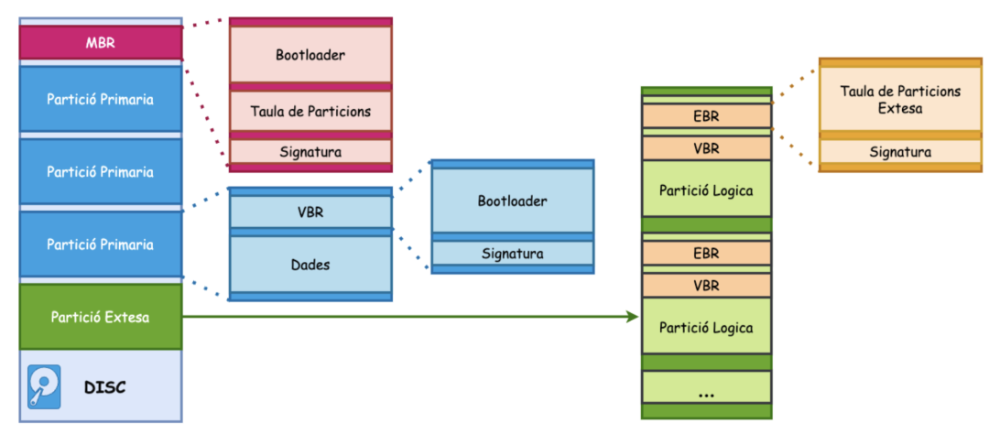

# AMSA - Setmana 2: Arrencada del sistema (part 1)

**Nom:** Nel Banqué Torné

---

## Resum teòric

### Etapes d’arrencada

---

### Fase 1: Maquinària

La placa base envia una senyal a la **PSU** (*Power Supply Unit*). La PSU proporciona tensió estable i activa la **CPU**. La CPU inicialitza registres interns i col·loca el punter d’instruccions a l’adreça de *reset*.

---

### Fase 2: Firmware

El firmware prova, detecta, configura i inicialitza dispositius.

---

### Les etapes són

- **Inicialització del firmware**
- **Diagnòstic i detecció**
- **Arrencada del sistema**

El *firmware* està emmagatzemat en un xip de memòria *flash* a la placa base. L’actualització (*flashing*) substitueix el contingut d’aquest xip per una versió nova. Fer-ho pot comportar riscos.

---

### Tipus de firmware

- **BIOS**: Firmware antic que inicia el maquinari i carrega el sistema operatiu.
- **UEFI**: Versió moderna i millorada de la BIOS amb més velocitat, seguretat i suport per a discos grans.

---

### Diferències entre BIOS i UEFI

  

---

### Taula de particions MBR

La seva estructura es compon de la manera següent:

| Component                        | Mida         | Descripció                                      |
|-----------------------------------|--------------|-------------------------------------------------|
| **Bootloader de primera etapa**   | 446 bytes    | Conté el codi d’arrencada                       |
| **Taula de particions**           | 64 bytes     | Informació de fins a 4 particions                |
| **Signatura**                     | 2 bytes      | Marca de final, identifica la taula com a vàlida |

---

### Particions

Les particions són divisions lògiques d’un disc dur o SSD que permeten separar i organitzar l’espai d’emmagatzematge com si fossin “discos independents” dins del mateix dispositiu físic.

**Tipus de particions:**

- **Primàries:** Fins a 4 per disc, contenen sistema de fitxers i poden tenir VBR per arrencar.
- **Estesa:** Substitueix una primària, fa de contenidor de lògiques, sense sistema de fitxers ni VBR.
- **Lògiques:** Dins de l’estesa, cada una amb el seu EBR.

---

### Taula de particions GPT

- **Compatibilitat i protecció:** Crea una partició especial perquè discos GPT siguin reconeguts per eines MBR, però sense modificar-los.
- **GPT Header Primari:** Al sector LBA 1, defineix l’espai i guarda la taula de particions (mínim 128).
- **GPT Header Secundari:** Còpia de seguretat al final del disc per recuperar dades si falla el primari.

---

### UEFI

**UEFI** és un firmware modern que inicia el maquinari, carrega el sistema operatiu i ofereix més velocitat, seguretat i suport per a discos grans que la BIOS.

- **Sistema de fitxers propi:** UEFI no utilitza MBR tradicional de 512 B ni codi de *boot* limitat.
- **EFI System Partition (ESP):** *Filesystem* propi (FAT32, 100 a 550 MB), marcada amb *boot flag*, mai conté particions d’OS.
- **Estructura de la partició EFI:** Cada OS té la seva carpeta dins de l’ESP amb els fitxers per carregar el sistema operatiu; en Linux sovint es munta sota `/boot/efi`.
- **Mini sistema operatiu:** UEFI funciona com un mini sistema operatiu, executa fitxers EFI executables, permet drivers i aplicacions independents del SO, i els *bootloaders* natius han de respectar aquest format.
- **UEFI Boot Manager:** Motor de política del firmware per a l’arrencada, configurable via variables globals a NVRAM, carrega drivers i aplicacions UEFI en l’ordre definit; Linux pot usar `efibootmgr` per modificar la configuració.

---

### Consola de la UEFI

La consola de la UEFI és una interfície de línia de comandes que permet interactuar directament amb el firmware UEFI per realitzar tasques avançades de diagnòstic, configuració i manteniment del sistema.

---

### La partició EFI

La partició EFI (ESP) és una partició especial del disc amb un sistema de fitxers propi (**FAT32**) que conté els fitxers necessaris perquè UEFI pugui arrencar el sistema operatiu i carregar drivers o aplicacions independents del SO.

---

### Bootloaders i tipus

Un **bootloader** és un programa que carrega el sistema operatiu des del disc quan s’encén l’ordinador. El *bootloader* de primera etapa s’executa primer i localitza el *bootloader* de segona etapa, que és més complet i carrega tot el sistema operatiu a la memòria.

---

## Exemples pràctics

> *No s’han registrat exemples per aquesta setmana.*

---

## Dubtes, preguntes i aspectes interessants

- **Com puc mirar les particions del meu disc?**
- **És possible arrencar sense partició EFI?** (Sí)

---

## Reflexió personal

Aquesta setmana he après la importància del firmware i de les taules de particions en l’arrencada. Conèixer la diferència entre BIOS i UEFI, així com el paper de la partició EFI, m’ajuda a entendre millor problemes comuns en instal·lacions i arrencades de sistemes operatius.

