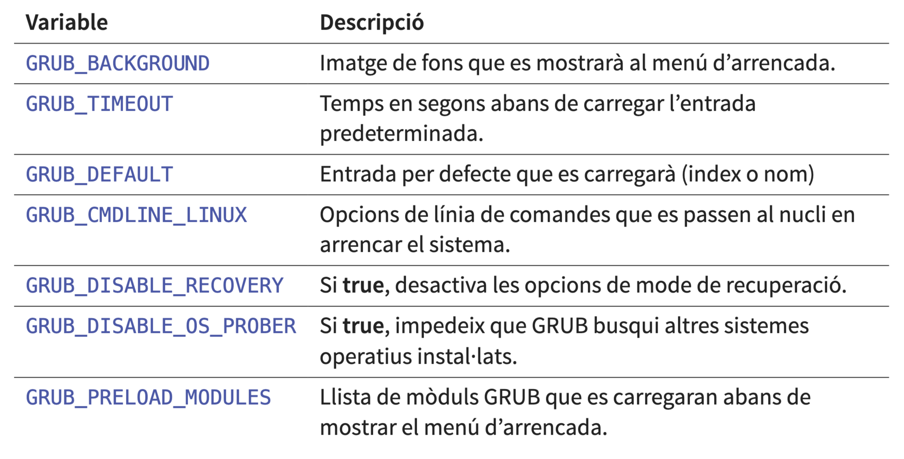
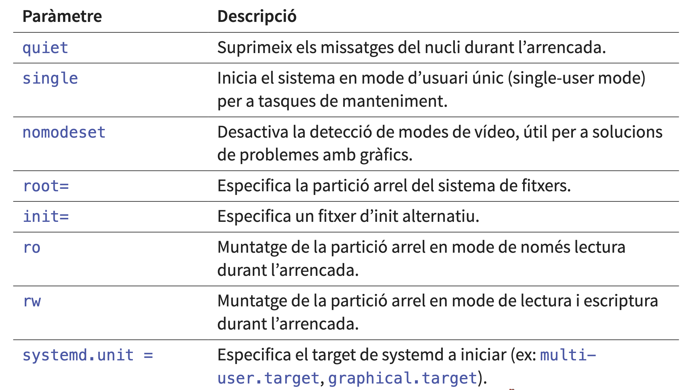

# AMSA - Setmana 3: Arrencada del sistema (part 2)
**Nom:** Nel Banqué Torné

## Resum teòric
### GRUB i GRUB2
GRUB (GRand Unified Bootloader) és un gestor d’arrencada. La seva funció principal és carregar un kernel del sistema operatiu a la memòria i iniciar el procés d’arrencada.

### Funcions clau:
- Permet arrencar múltiples sistemes operatius (multi-boot).
- Ofereix configuració d’opcions i paràmetres del kernel.
- Suporta diversos sistemes de fitxers (ext4, Btrfs, XFS...).
- Inclou una consola interactiva per configuració i resolució de problemes.

### Execució del GRUB
L’execució del GRUB comença amb un codi inicial molt petit (Stage 1) al MBR/VBR o com a fitxer EFI, pot incloure un pas opcional (Stage 1.5) amb suport bàsic de sistemes de fitxers, i finalitza amb el GRUB complet (Stage 2), que mostra el menú d’arrencada, carrega mòduls addicionals i passa el control al kernel.

### Configuració del GRUB
- Fitxer principal de configuració: `/boot/grub/grub.cfg` (o `/boot/grub2/grub.cfg`` en algunes distribucions).
- `/etc/default/grub` : Opcions generals de configuració i variables d’entorn.
- `/etc/grub.d/` Directori amb scripts que generen grub.cfg:

Un cop modificats els fitxers necessaris, cal regenerar `grub.cfg`

### Variables `/etc/default/grub`

### Paràmetres del kernel més comuns

### Secure boot
És una característica de seguretat del firmware UEFI que assegura que només s’executi programari de confiança durant l’arrencada.

- UEFI comprova la signatura digital del bootloader EFI (per exemple, `grubx64.efi`) abans de carregar-lo.  
- La signatura es compara amb les claus de confiança guardades a la **DB** (*Database of allowed signatures*) del firmware.  
- Si la signatura és vàlida, UEFI carrega i executa el bootloader; en cas contrari, mostra un missatge d’error.  
- Es poden carregar mòduls addicionals signats, verificats també pel mateix GRUB (opcional).  
- El kernel Linux pot estar signat (opcional, amb **Linux Kernel Signing**).  
- Amb **Shim**, aquest actua d’intermediari: UEFI confia en Shim, i Shim verifica GRUB i el kernel.  

Cal recalcar que també té alguns problemes.

### Inici del sistema operatiu 
El **kernel** és el nucli del sistema operatiu, responsable de gestionar els recursos del sistema, com la memòria, el processador, els dispositius d’entrada/sortida, la xarxa i els processos d’usuari.

Per carregar-lo, el bootloader necessita: 
- Ruta del kernel
- Partició arrel
- Fitxer de configuració del bootloader
- Càrrega de l'initramfs

### Initramfs o initrd
És un petit sistema de fitxers a la RAM que permet al kernel muntar la partició arrel, carregar mòduls essencials i executar scripts d’inicialització abans d’iniciar el sistema complet.

### Etapes de l'initramfs:
- **Descompressió a la RAM**  
  El fitxer `CPIO` de l’initramfs es descomprimeix a un sistema de fitxers temporal a `RAM` (`tmpfs`), creant l’entorn mínim necessari per iniciar el kernel.  

- **Execució de l’script `/init`**  
  `/init` és l’entrypoint principal de l’initramfs.  
  Executa la seqüència d’inicialització: muntatge de sistemes virtuals, càrrega de mòduls i preparació de l’entorn.  

- **Creació del sistema de fitxers temporal**  
  Muntatge de `/proc`, `/sys` i `/dev`.  
  Creació de directoris temporals (`/tmp`, `/run`) per permetre que els scripts i utilitats funcionin.

- **Carregar mòduls del kernel**  
  Carrega controladors necessaris per accedir a maquinari (`discos`, controladors de xarxa, `LVM`, `RAID`, xifrat).  
  Si els mòduls estan integrats al kernel, aquesta etapa pot ser mínima o nul·la.  

- **Muntatge de la partició arrel real**  
  Localitza la partició arrel (per exemple `/dev/sda1` o `UUID=...`).  
  Muntatge en un punt temporal (`/mnt/root` o similar).  

- **Transició al sistema complet (`switch_root`)**  
  Substitueix l’entorn temporal de l’initramfs pel sistema de fitxers real.  
  Executa el binari `init` del sistema complet (normalment `/sbin/init` o `systemd`).

- **Alliberament de l’initramfs**  
  Destruir l’entorn temporal a `RAM`.  
  Alliberar la memòria utilitzada pel sistema de fitxers temporal, deixant el control complet al sistema operatiu.

### Contingut de l'initramfs
- **Fitxers executables**  
  Ex: `BusyBox`, que encapsula moltes utilitats Unix (`ls`, `cp`, `mount`, `shell`, etc.).  
  Poden incloure altres programes compilats estàticament.  

- **Mòduls del kernel**  
  Controladors per `discos`, `xarxes`, sistemes `RAID` o `LVM`.  
  Són carregats si no estan integrats dins del nucli.  

- **Fitxers de dispositiu i sistemes especials**  
  `/dev` conté dispositius com `tty` o `null`.  
  Gestionats per utilitats com `mdev` o `udev`.  

Tots aquests elements es troben comprimits en un fitxer `CPIO`, descomprimits a `RAM` durant l’arrencada i executats per l’script `/init`.

### Initrmfs tools
A continuació es mostren uns exemples d'eines de l'initramfs:
- **/etc/initramfs-tools/modules**  
  Llista de mòduls addicionals del kernel a incloure a l’initramfs, per exemple controladors de xarxa o discos `RAID`.  

- **/etc/initramfs-tools/hooks/**  
  Scripts que s’executen durant la creació de l’initramfs, útils per afegir fitxers o directoris personalitzats.  

- **/etc/initramfs-tools/conf.d/**  
  Fitxers de configuració addicionals per modificar paràmetres específics de l’initramfs.  

- **/etc/initramfs-tools/initramfs.conf**  
  Configuració principal, inclou opcions com compressió, ús de scripts i paràmetres de muntatge.  

- **/usr/share/initramfs-tools/**  
  Scripts i fitxers estàndard utilitzats per `initramfs-tools`, normalment no modificats.

### Quan regenerar l'initramfs?
- **Actualització del nucli**  
  Quan es compila o instal·la un nou kernel, l’initramfs associat ha de ser regenerat per garantir que carrega correctament els mòduls i el maquinari necessari.  

- **Configuració RAID**  
  Si es modifiquen o s’afegeixen sistemes `RAID`, l’initramfs ha de reflectir aquests canvis per assegurar una arrencada correcta.  

- **Xifrat de discos**  
  Per a sistemes amb particions xifrades (`LUKS`), cal actualitzar l’initramfs després de canvis en la configuració de xifrat per poder accedir a les particions durant l’arrencada.  

- **Configuració de xarxa**  
  Si es canvien components de xarxa que s’utilitzen en el procés d’arrencada (per exemple, arrencada `PXE`).

## Exemples pràctics
- *(No s’han registrat exemples per aquesta setmana.)*  

## Dubtes, preguntes i aspectes interessants
- Què és dracut? (Dracut és una eina Linux per generar initramfs de manera modular, creant un entorn mínim amb els mòduls necessaris per iniciar el sistema i suportant RAID, LVM i discos xifrats.)
## Reflexió personal

