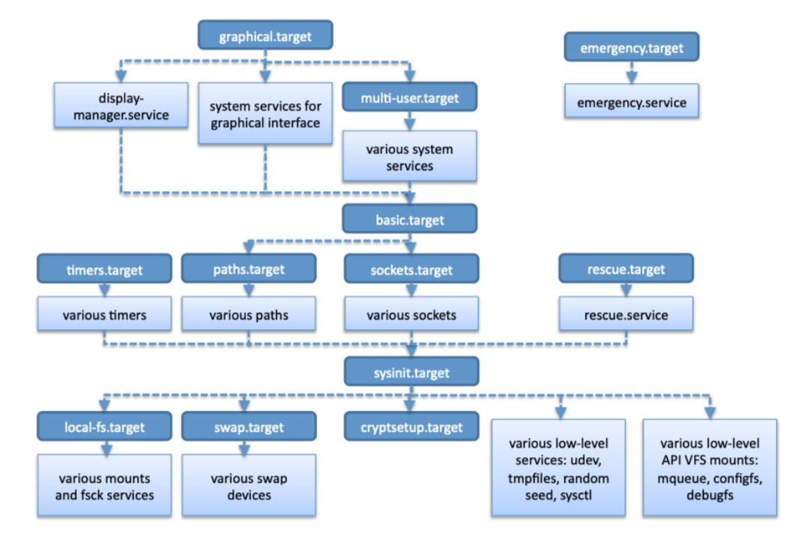

# AMSA - Setmana 4: Arrencada del sistema (part 3)

**Nom:** Nel Banqué Torné

---

## Resum teòric

### PID 1: `init` / `systemd`

Quan acaba la inicialització del kernel i s’executa l’`initramfs`, el sistema fa el pas a l’espai d’usuari amb el comandament `switch_root`, que substitueix l’arrel temporal per la partició arrel real. A partir d’aquí, el **PID 1** és el primer procés de l’espai d’usuari i s’encarrega de gestionar la resta de processos. Actualment, la majoria de sistemes utilitzen **systemd**.

---

### Funcions del PID 1

- **Gestió de la inicialització del sistema:**  
    Carrega els serveis i dimonis necessaris per al bon funcionament del sistema.

- **Gestió dels processos del sistema:**  
    Controla la creació, execució i finalització dels processos.  
    Si un procés orfe continua en execució, el PID 1 n’assumeix la gestió i eventualment la seva terminació.

- **Arrel de l’arbre de processos:**  
    Tots els altres processos del sistema pengen d’ell, directament o indirectament.  
    Això el fa essencial per a l’estabilitat i la continuïtat del sistema.

- **Apagat i reinici del sistema:**  
    Controla aquestes operacions assegurant que els processos es tanquin adequadament i que el sistema es desconnecti de forma segura.

---

### `systemd` vs `SysVinit`

El canvi de **SysVinit** a **systemd** en moltes distribucions de Linux va ser motivat per la necessitat de millorar l’eficiència i la gestió dels serveis del sistema.

| Característica | SysVinit | systemd |
|---|---|---|
| Tipus | Tradicional | Modern |
| Execució | Seqüencial | Paral·lela |
| Simplicitat | Fàcil d’entendre | Més complex |
| Scripts | `/etc/init.d/` | Fitxers d’unitat |
| Eines addicionals | No | Sí (`journald`, sockets, etc.) |

> Tot i així, **systemd** ha rebut bastantes crítiques per la complexitat, dependències de sistemes i pel trencament de la filosofia Unix tradicional.

---

### Executar els Targets o Runlevels

El **PID 1** executa els *targets* de systemd, que defineixen l’estat del sistema i els serveis a carregar.  
La transició entre *targets* es fa amb:

```bash
systemctl isolate <target>   # Manual
systemctl set-default <target>   # Automàtica
```

---

### Unitat de Systemd

Els *units* són els fitxers de configuració de systemd que defineixen els serveis, ens permeten gestionar-los i controlar-los.

- `/etc/systemd/system/`: Fitxers d’unitat personalitzats per l’administrador.
- `/run/systemd/system/`: Configuració en temps d’execució (afecta només una arrencada única).
- `/usr/lib/systemd/system/`: Configuració proporcionada per la distribució.  
    A Debian és `/lib/systemd/system/`.

#### Tipus d’unitats

- **Services**
- **Sockets**
- **Devices**
- **Mounts**
- **Paths**
- **Timers**
- **Targets**

---

### Targets i Systemd



---

### Dependències entre unitats

Les unitats són objectes gestionats per systemd. Les dependències són associacions entre elles. Cada tipus d’unitat té algunes dependències per defecte (a menys que s’especifiqui el contrari).

#### Relacionals

- **Requires:** Una unitat depèn d’una altra per activar-se. Si la requerida no està activa, tampoc ho estarà la dependent.
- **Wants:** Similar a *Requires* però menys estricte. Si la requerida no està activa, la dependent no queda bloquejada.
- **BindsTo:** Com *Requires*, però si la unitat requerida es deté, també es deté la que hi està vinculada.
- **PartOf:** Una unitat forma part d’una altra. Si la unitat pare es deté, també ho fa la filla.
- **Conflicts:** Dues unitats no poden estar actives alhora. Si una s’activa, l’altra es desactiva automàticament.

#### Ordenació

- **After:** Indica que una unitat s’inicia després d’una altra. No crea dependència estricta, només defineix l’ordre.
- **Before:** Indica que una unitat s’inicia abans d’una altra. Tampoc crea dependència estricta, només l’ordre.

---

### Transacció a systemd

Cada vegada que un usuari o servei sol·licita una acció (iniciar, aturar...), es crea una **transacció** que gestiona l’execució ordenada de les unitats afectades.

1. **Creació de feines (*jobs*)**
        - Es crea una feina per a la unitat sol·licitada.
        - També s’afegeixen les feines de les seves dependències.

2. **Minimització de la transacció**
        - Eliminar feines duplicades o redundants.
        - Eliminar feines sense referències d’altres *jobs*.

3. **Resolució de cicles de dependències**
        - Detectar *loops* en el gràfic de dependències.
        - Trencar-los eliminant feines problemàtiques per evitar *deadlocks*.

4. **Fusió i optimització de feines**
        - Fusionar feines similars per reduir operacions.
        - Donar prioritat a feines ja existents a la cua.

5. **Enviament i execució**
        - Afegir les feines a la cua de *jobs* de systemd.
        - Executar-les segons dependències i ordre optimitzat.

---

### `systemctl`

La comanda **systemctl** és l’eina principal per gestionar serveis i unitats amb systemd.  
Algunes operacions bàsiques són:

```bash
systemctl start <unit>      # Inicia una unitat
systemctl stop <unit>       # Atura una unitat
systemctl restart <unit>    # Reinicia una unitat
systemctl status <unit>     # Mostra l’estat actual d’una unitat
systemctl enable <unit>     # Habilita una unitat perquè s’iniciï en arrencar
systemctl disable <unit>    # Deshabilita una unitat perquè no s’iniciï en arrencar
```

---

### Fitxers d’unitat i opcions

A més de les comandes `systemctl`, systemd es configura amb fitxers d’unitat que defineixen el comportament dels serveis.  
Les seccions més habituals són:

- **[Unit]**: Conté metadades i dependències de la unitat.
- **[Service]**: Defineix com s’executa un servei (per exemple, `ExecStart`, `ExecStop`).
- **[Install]**: Indica com i quan s’instal·la o habilita la unitat (`WantedBy`, `RequiredBy`).

---

### Scripts de l’usuari

Un cop el sistema ha arrencat i els serveis estan en marxa, cada usuari pot tenir configuracions pròpies mitjançant scripts que s’executen en iniciar o tancar sessió:

- `/etc/profile`: Configuració global per a tots els usuaris (s’executa en iniciar sessió).
- `/etc/profile.d/`: Scripts addicionals que també s’executen en iniciar sessió.
- `/etc/bashrc`: Configuració per a tots els shells interactius.
- `~/.bashrc`: Configuració personal de l’usuari per a shells interactius.
- `~/.bash_profile`: Executat en iniciar sessió a la terminal (configura entorn, PATH, etc.).
- `~/.bash_logout`: Executat en tancar sessió; permet posar comandes de neteja.
- `~/.bash_history`: Desa l’historial de les comandes executades per l’usuari al shell.

---

## Exemples pràctics

- Quan hi ha dos fitxers amb el mateix nom, **systemd** carregarà només el del directori més alt en la jerarquia.  
    Per exemple, la configuració a `/etc` sempre sobreescriu la de `/usr`.

---

## Dubtes, preguntes i aspectes interessants

- És interessant la història de l’usuari [JiaT75 de GitHub](https://github.com/JiaT75), que va aconseguir introduir modificacions malicioses a **xz-utils**, aprofitant-les per comprometre sistemes a través de dependències amb systemd.

- Què passa si modifico un fitxer d’unitat a `/etc`?  
    (La configuració personalitzada tindrà prioritat sobre la de la distribució.)

---

## Reflexió personal

Després d’estudiar el funcionament de **systemd** i la gestió de processos, veig clar que la complexitat de l’arrencada moderna requereix eines potents però també una bona comprensió per evitar errors.  
Aprendre com interactuen les unitats i les dependències és important.


