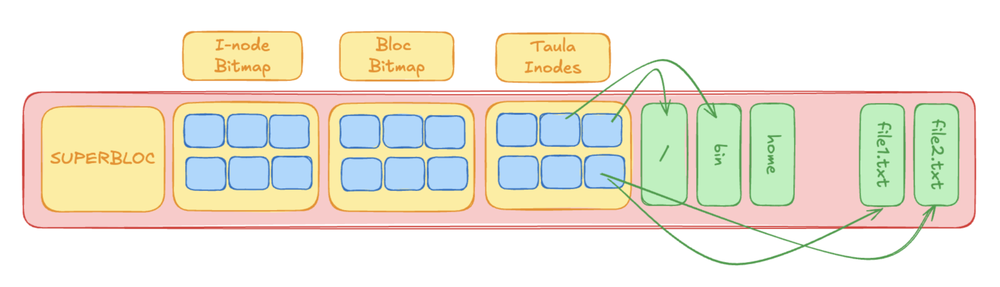

# AMSA - Setmana 5: Sistema de fitxers (part 1)

**Nom:** Nel Banqué Torné

---

## Resum teòric
Un sistema de fitxers és la manera com un sistema operatiu organitza i gestiona les dades dins d’un dispositiu d’emmagatzematge (com un disc dur o una memòria USB), permetent desar, trobar i accedir als arxius. És essencial per al sistema operatiu.

| Tipus de Recurs | Exemple de Path | Sistema de Fitxers |
|---|---|---|
| Procés/Estat del Kernel | `/proc/PID` (p. ex., `/proc/1234/status`) | `procfs` (Memòria, no disc) |
| Dispositiu de Blocs | `/dev/sda1` | `devfs` o `udev` |
| Punts de Configuració | `/etc/hosts`, `/usr/bin/comando` | FS persistent (Ext4, XFS) |
| Dades d’Usuari | `/home/username/documents` | FS persistent |
| Xarxa | `/dev/tcp/80` (en certs entorns, e.g., Plan 9) | Ús de *Sockets* com a *File Descriptors* |

### Dispositius i Device Files

Un Fitxer de Dispositiu (Device File o Node) és un nom assignat a un dispositiu d’E/S (Entrada/Sortida), ja sigui físic (disc, targeta de so) o lògic (port de xarxa, terminal).

| Tipus de Dispositiu | Exemples Comuns | Característica |
|---|---|---|
| Blocs (Block Devices) | `/dev/sda` (Disc sencer), `/dev/sdb1` (Partició), `/dev/md0` (RAID) | Transfereixen dades en blocs de mida fixa. Són cachejables i permeten accés aleatori. |
| Caràcters (Character Devices) | `/dev/ttyX` (Terminals), `/dev/lp0` (Port Paral·lel), `/dev/input/mouse0` | Transfereixen dades seqüencialment caràcter a caràcter. No tenen caching de blocs. |

Els drivers són rutines del kernel que gestionen la comunicació amb el hardware mitjançant interrupcions, DMA i E/S programada. Sense ells, els fitxers a `/dev` no tindrien utilitat.

---

### Abstraccions bàsiques del VFS

**Virtual Filesystem Switch (VFS)**: Un Sistema de Fitxers (FS) és la capa lògica que gestiona l’accés i l’organització dels fitxers i directoris dins d’un dispositiu d’emmagatzematge.

**Aquestes són unes abstraccions comunes del VFS**:
| Abstracció | Ubicació | Funció Tècnica | Persistència |
|---|---|---|---|
| **Superbloc** | Disc + Memòria | Conté **metadata global** del FS: tipus, mida, estat, punters clau | Persistent |
| **Inode** | Disc + Memòria | **Metadata del fitxer**: permisos, timestamps, punters a blocs de dades | Persistent |
| **Dentry** | Només Memòria | **Entrada de Directori**: cacheja nom del fitxer ↔ inode | Temporal |
| **File Object** | Només Memòria | Representa un fitxer obert per un procés (*file descriptors*) | Temporal |

### Jerarquia lògica de les Abstraccions

### Relacions *In-Memory* del VFS
- **Múltiples descriptors de fitxer** poden apuntar al mateix fitxer (`dup()`).
- **Múltiples abstraccions de fitxer** poden apuntar a la mateixa **Dentry** (obrim el mateix *path* diverses vegades).
- **Múltiples Dentries** poden apuntar al mateix **Inode** (Hard Links).

### El Superbloc
El Superbloc és el punt de referència absolut de qualsevol Sistema de Fitxers (FS). Sense aquesta estructura, el kernel no pot fer res.

**Aquesta és la seva organització físcia**

**Aquesta és la seva estructura**
- **fs_type**: El tipus de FS (p. ex., EXT4_MAGIC).
- **s_blocks_count**: El nombre total de blocs al FS.
- **s_log_block_size**: Defineix la mida del bloc lògic (p. ex., 1K, 4K). Tota la I/O es fa en aquesta unitat.
- **Punteres a Bitmaps**: Adreces del primer bloc de l’**IMAP** i el **DMAP**.
- **Estat del FS**: Indica si el FS va ser desmuntat netament o si va patir un *crash* (`s_state` - important per al `fsck`).

### Mapes de bits (Bitmaps)
Un bitmap és una estructura que indica quins blocs d’un dispositiu estan ocupats o lliures. 1=Ocupat, 0=lliure.

---
### Operacions bàsiques del VFS i crides al sistema
El **VFS (Virtual File System)** ofereix operacions bàsiques per treballar amb fitxers i directoris, com obrir, llegir, escriure o tancar.  
Aquestes operacions es realitzen mitjançant crides al sistema que permeten a les aplicacions accedir als recursos del sistema de fitxers.  
Exemples: `open()` per obrir un fitxer i `read()` per llegir-ne el contingut.

### Operacions amb fitxers

#### Obertura
1. Es recorre el path component a component.  
2. Es resol la **Dentry** (cache).  
3. Es carrega l’**Inode** si no és a la cache.  
4. Es crea un nou **File Object** i s’assigna un **File Descriptor (FD)** al procés.  

#### Consulta d’atributs
1. Accés a l’**Inode** via FD.  
2. Si no és a la cache, es llegeix del disc.  
3. Es retornen atributs com **UID, GID, permisos, mida i timestamps**.  

#### Lectura
1. Validar FD i permisos.  
2. Calcular quins blocs llegir (offset, mida).  
3. Accedir a dades a través de *file → dentry → inode → blocs de dades*.  
4. Retornar dades a la **VFS**.  
5. Copiar dades a l’espai d’usuari.  

#### Escriptura
1. Validar FD i permisos d’escriptura.  
2. Calcular nous blocs si cal.  
3. Si el fitxer creix: assignar blocs, actualitzar **bitmaps** i **inode**, registrar al **journal**.  
4. Escriure dades a la **page cache** (*dirty pages*).  
5. Retornar bytes escrits al procés.  
6. **Writeback asíncron**: flush de dirty pages al disc i commit de la transacció al journal.  

#### Escriptura asíncrona i Writeback
L’escriptura asíncrona permet que les operacions d’escriptura es facin en segon pla, millorant la resposta del sistema.  
Les dades primer passen a la **page cache** i es poden escriure al disc més tard.  

#### Creació de directoris
1. Resoldre la **Dentry** i determinar l’**Inode** pare.  
2. Llegir blocs del directori pare i trobar espai per a la nova entrada.  
3. Crear nou **Inode** pel directori.  
4. Afegir la nova Dentry al directori pare i actualitzar blocs.  
5. Retornar èxit o error.  

#### Eliminació de fitxers
1. Resoldre la **Dentry** i determinar l’**Inode** pare.  
2. Localitzar i esborrar la Dentry del directori pare.  
3. Comprovar enllaços: si és l’últim, alliberar blocs i inode.  
4. Actualitzar metadades al disc i confirmar canvis.  
5. Retornar èxit o error.  

---

### Caché i Optimitzacions

#### Caché d'inodes (icache)
- Desa els **inodes** recentment utilitzats a memòria.  
- Evita rellegir metadades del disc.  
- Millora rendiment en accessos repetits al mateix fitxer.  

#### Caché de Dentries
- Desa les **entrades de directori** (path ↔ inode).  
- Redueix el cost de resoldre rutes llargues.  
- Fonamental per accelerar operacions com `open()` i `stat()`.  

#### Caché de pàgines: Dades i E/S
- Desa **blocs de dades** de fitxers i directoris.  
- Permet que lectures posteriors siguin servides directament de memòria.  
- Les escriptures s’acumulen com a *dirty pages* i es guarden al disc amb el **writeback asíncron**.  

---

### Sistemes de fitxers específics

#### FAT: File Allocation Table
- Sistema de fitxers creat el **1977**, popularitzat per **MS-DOS**.  
- Encara en ús amb **FAT32**: USB, targetes de memòria, particions EFI.  
- **File Allocation Table**: estructura de llista enllaçada amb els blocs ocupats per cada fitxer.  
- Determina si un bloc està en ús o disponible.  

#### FAT: Organització de directoris
Els directoris en FAT són fitxers especials que contenen entrades de 32 bytes per a cada fitxer o subdirectori. Cada entrada inclou: nom, atributs, timestamps, primer clúster i mida del fitxer.

#### FAT: Limitacions Tècniques

**Limitacions de capacitat**
- **FAT32**: màxim **2TB** per volum.
- **FAT32**: màxim **4GB** per fitxer.

**Problemes de rendiment**
- Localització de blocs lliures: requereix **scan complet** de la FAT.
- **Fragmentació severa** → baixa localitat de dades.
- **Fragmentació de metadades** → cerques costoses.
- **Llistes enllaçades** poc eficients amb fitxers grans.

**Impacte pràctic**
- Un fitxer de **16MB** (4096 clústers de 4KB) requereix **4096 lectures** de la FAT per accés seqüencial complet.

### EXT: Extended File System
Els sistemes **EXT** són la família de sistemes de fitxers dissenyats per a **Linux**, pensats com a evolució dels Unix tradicionals.  
Es caracteritzen per ser **eficients, robustos i fiables**, amb suport de **journaling** (a partir d’EXT3) per millorar la recuperació davant errors.  
L’última versió, **EXT4**, és la més utilitzada actualment: ofereix grans capacitats, millor gestió de fitxers grans i menor fragmentació.  

#### EXT: Organització

> EXT3: Imagineu que un fitxer necessita augmentar la seva mida, i això requereix assignar un nou bloc de dades i actualitzar l’inode per reflectir aquesta nova assignació. Aquest procés implica múltiples operacions d’escriptura al disc (problema de consistència).

### Journaling i Consistència
El **journaling** garanteix la consistència del sistema de fitxers davant errors o caigudes mitjançant transaccions.

**Fase 1: Preparació**
- Crear transacció (T1).  
- Escriure nou bloc de dades i actualitzar **bitmap** i **inode**.  
- Confirmar (commit) la transacció T1 al journal.  

**Fase 2: Aplicació**
- Aplicar els canvis registrats al sistema de fitxers.  
- Marcar la transacció T1 com a completa.  

Això permet recuperar l’estat coherent fins i tot si el sistema falla durant l’escriptura.

### ext4: Millores d’Eficiència i Organització

#### Extents
- Resol el problema de la gestió ineficient d’ext2/3.  
- Un **extent** descriu un rang de blocs contigus (bloc inicial + nombre de blocs).  
- Redueix la fragmentació i millora l’assignació.  
- Cada extent pot mapar fins a **128 MiB** d’espai contigu.  
- Un inode pot contenir directament fins a 4 extents; si cal més, es fa servir un **HTree**.  

#### HTree/BTree
- Un **B-tree** és una estructura equilibrada per cerques i insercions eficients.  
- **HTree** és una variant adaptada a **ext4** per indexar fitxers i directoris.  
- Distribueix les entrades entre nodes fulla i no fulla, amb capçaleres específiques.  
- L’**inode/arrel** apunta a la capçalera de l’HTree.  

#### Assignació multibloc i retardada
- **Multibloc**: assigna diversos blocs consecutius d’una sola vegada → menys fragmentació i millor localitat.  
- **Retardada**: l’assignació espera fins just abans d’escriure → permet agrupar escriptures i optimitzar la distribució.  

---

## Exemples pràctics

---

## Dubtes, preguntes i aspectes interessants

---

## Reflexió personal