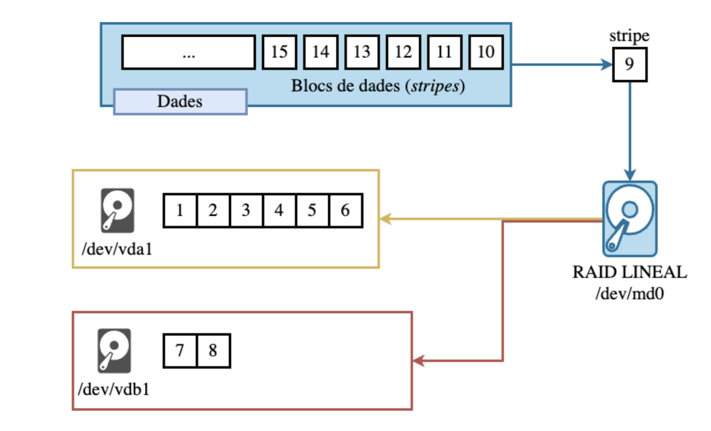
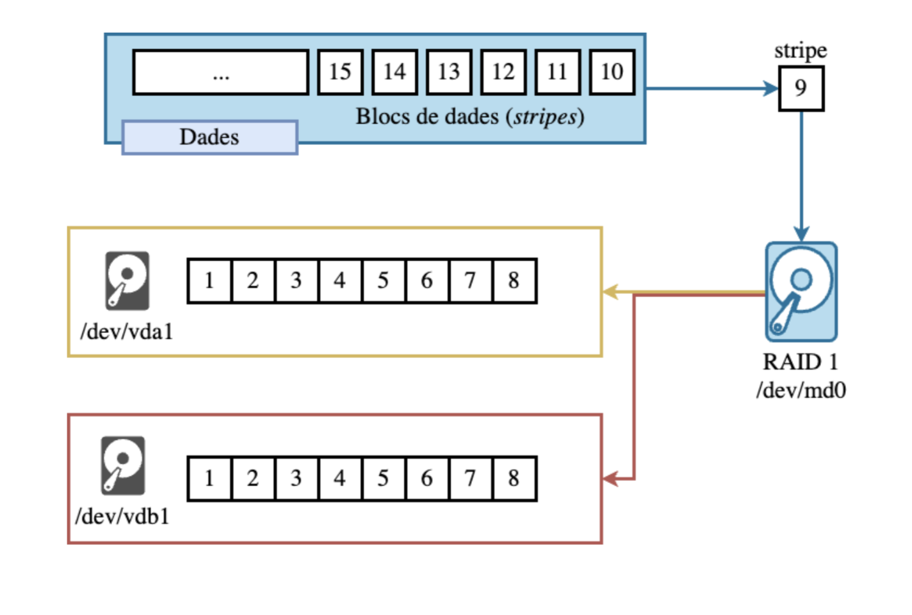
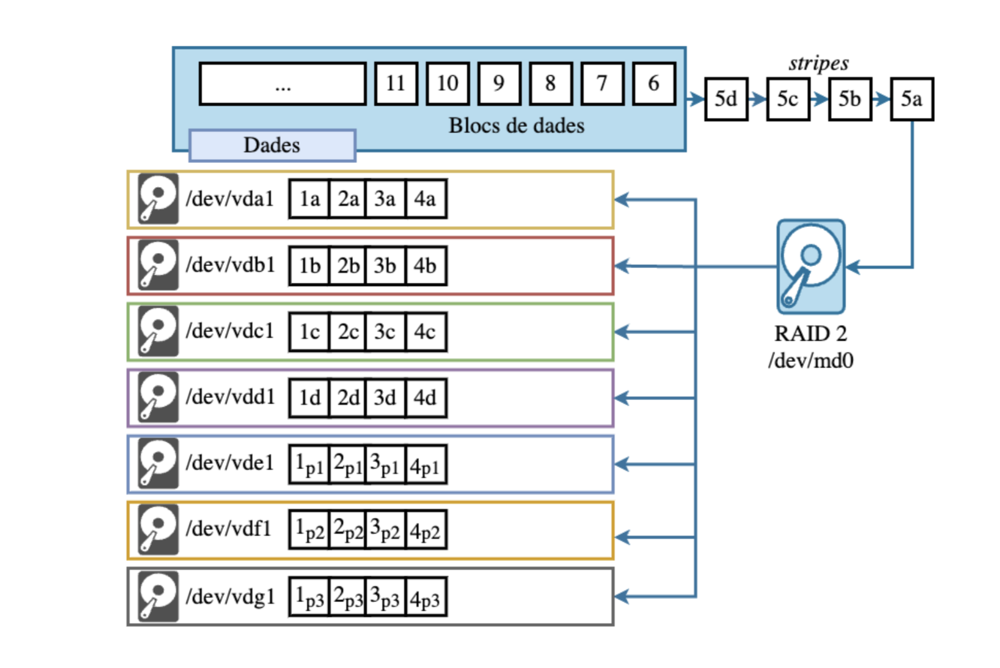
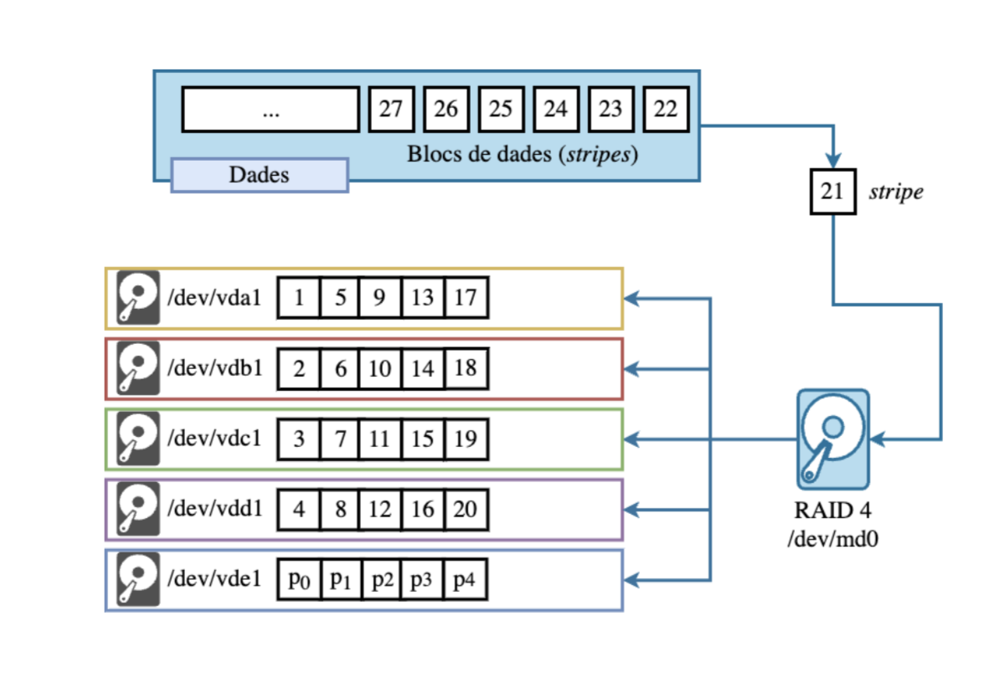
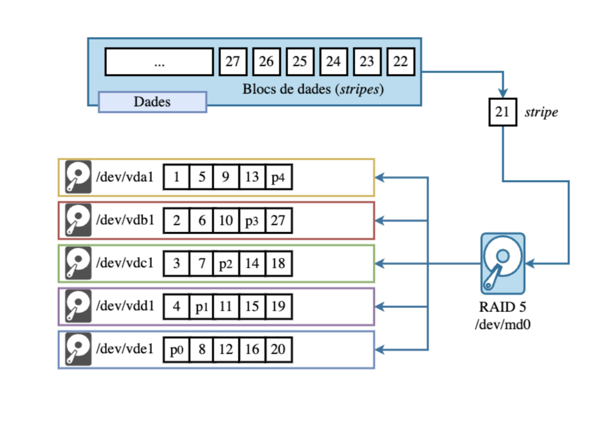
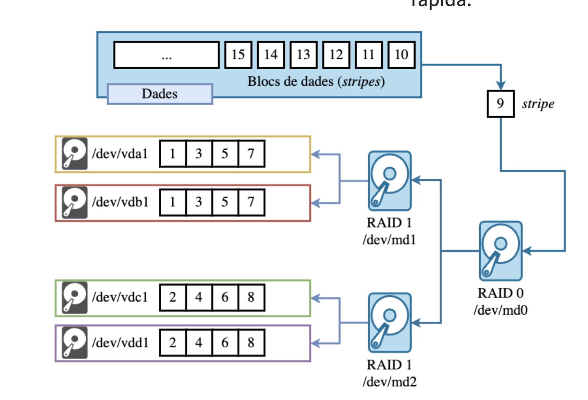
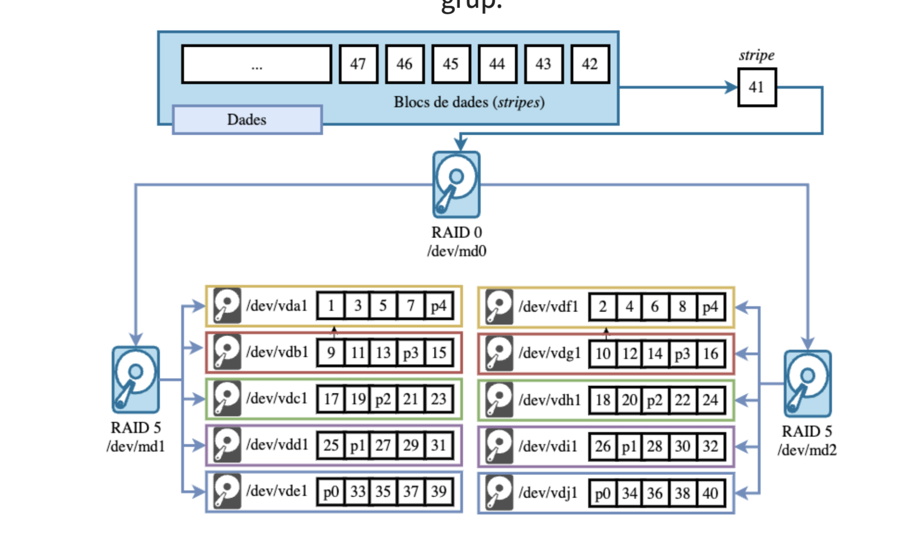

# AMSA – Setmana 6: Sistema de fitxers (part 2)

**Nom:** Nel Banqué Torné

---

## Resum teòric

Un *RAID* és una tecnologia d’emmagatzematge que combina diversos discos durs físics en una sola unitat lògica per tal de millorar el rendiment, la seguretat de les dades o ambdues coses.

--- 

### Conceptes bàsics:

- **Redundància**: Capacitat de tolerar fallades de dispositiu (quantitat de discs que poden fallar sense perdre dades).

- **Rendiment**: Mesurat en IOPS i ample de banda MB/s. Depèn de la mida de stripe,nombre de discs i patró d’accés (seqüencial vs aleatori).

- **Capacitat**: La capacitat total del sistema és la suma de les capacitats dels dispositius que el formen, tenint en compte la redundància.

- **Stripe**: Un stripe és una unitat d’informació que es distribueix entre els diferents dispositius que formen el RAID. Conjunt de blocs distribuïts entre discs dins del RAID.

- **Bloc**: Un bloc és una unitat d’informació que es llegeix o s’escriu en un dispositiu d’emmagatzematge. (512B, 4KB…).

---

### Implementacions de RAID

#### Software RAID
- Implementat a nivell de sistema operatiu.
- Avantatges: flexible i fàcil de configurar.
- Inconvenients: consumeix CPU.

#### Hardware RAID
- Funciona amb una controladora dedicada.
- Avantatges: millor rendiment.
- Inconvenients: més car i depèn del maquinari.

#### Fake/BIOS RAID
- Solució híbrida amb suport de BIOS.
- Inconvenients: rendiment limitat i poca compatibilitat.

---

### Tipus de RAID

#### RAID Lineal
Concatena diversos discos en un sol espai d’emmagatzematge.
> No millora rendiment ni ofereix tolerància a fallades.

---

#### RAID 0 (Striping)
Divideix les dades en blocs i les distribueix entre diversos discos.
> Millora el rendiment però si falla un disc es perd tota la informació.

---

#### RAID 1 (Mirror)
Duplica les dades exactament en dos discos (o més).
> Alta seguretat, però només s’aprofita el 50% de la capacitat total.

---

#### RAID 2
Utilitza divisió a nivell de bit i discos addicionals per paritat.
> Basat en **codis de Hamming** per detectar i corregir errors.

---

#### Codis de Hamming
Els **codis de Hamming** permeten **detectar i corregir errors** a les dades.

- Corregeixen errors d'1 bit.
- Utilitzen **bits de comprovació (paritat)** col·locats estratègicament.
- Cada bit de paritat verifica una part del bloc de dades.
- Permeten saber **quin bit ha fallat** i corregir-lo.

> Basats en l’operació XOR: retorna 1 si dos bits són diferents i 0 si són iguals  
> (si tots els bits XOR = 0 → no hi ha errors)

> Al PowerPoint tens exemples visuals del seu funcionament.

---

#### RAID 3 i RAID 4
Aquests dos nivells utilitzen **paritat** per protegir dades.

- **RAID 3**: striping a nivell de byte + disc de paritat dedicat.  
  Ideal per grans fitxers seqüencials.

- **RAID 4**: striping a nivell de bloc + disc de paritat dedicat.  
  Millor que RAID 3 per lectura, però el disc de paritat és coll d'ampolla.

---

#### RAID 5
Utilitza **striping amb paritat distribuïda** entre tots els discos.  
És un dels nivells de RAID més utilitzats perquè combina **rendiment, seguretat i aprofitament d'espai**.

- Necessita **mínim 3 discos**
- **Tolera la fallada d’1 disc**
- Paritat distribuïda → no hi ha coll d’ampolla com a RAID 4
- Bon rendiment en lectura, moderat en escriptura

---

#### RAID 6
Similar a RAID 5 però amb **doble paritat**, cosa que aporta més seguretat en cas de fallada.

- Necessita **mínim 4 discos**
- **Tolera la fallada de 2 discos**
- Major seguretat però **lleugerament més lent** en escriptures
- Ideal per a entorns on la disponibilitat és crítica

---

#### RAID 10 (1+0)
Combinació de **mirroring (RAID 1)** i **striping (RAID 0)**.  
Ofereix **alt rendiment i alta seguretat**. 

>Tolerància variable segons quins discs fallen; reconstrucció molt més ràpida.

---

#### RAID 50 (5+0)
Combinació de **RAID 5 + RAID 0**.  
Escala molt bé per rendiment en sistemes grans.

> Stripe sobre múltiples conjunts RAID5. Millora rendiment i tolerància depenent de cada grup.

--- 

#### Comparativa de nivells RAID

| RAID | Descripció | Rendiment | Tolerància a fallades | Mínim discos |
|------|-------------|-----------|------------------------|---------------|
| Lineal | Concatena discos | ❌ | ❌ | 2 |
| RAID 0 | Striping | ✅✅ | ❌ | 2 |
| RAID 1 | Mirroring | ✅ | ✅ | 2 |
| RAID 2 | Hamming (obsolet) | ❌ | ✅ | 3 |
| RAID 3 | Striping + paritat (byte) | ✅ | ✅ | 3 |
| RAID 4 | Striping + paritat fixa | ✅ | ✅ | 3 |
| RAID 5 | Striping + paritat distribuïda | ✅✅ | ✅ | 3 |
| RAID 6 | Striping + doble paritat | ✅ | ✅✅ | 4 |
| RAID 10 | Mirror + striping | ✅✅✅ | ✅✅ | 4 |
| RAID 50 | RAID 5 + striping | ✅✅✅ | ✅ | 6 |

---

### RAIDs a Linux

#### Dispositiu `/dev/md*`

- Linux implementa **Software RAID** mitjançant el subsistema del kernel **MD (Multiple Device)**.
- El mòdul principal és **`md_mod`**, que crea dispositius virtuals de bloc `/dev/mdX` sobre dispositius físics (`/dev/sd*`, `/dev/nvme*`, etc.).
- Cada dispositiu MD és gestionat per un controlador **`mdX`** que manté una taula de metadades amb:
  - **Nivell RAID** configurat (`level`)
  - **Nombre de discos RAID** (`raid_disks`)
  - **Superbloc** amb informació de l’array (`superblock`)
  - **Estat de sincronització** i possibles fallades

---

#### Components del subsistema MD

| Component | Funció principal |
|-----------|------------------|
| **md_mod** | Gestor principal del subsistema MD (creació i manteniment de `/dev/mdX`). |
| **raid0, raid1, raid5, raid6, raid10** | Mòduls del kernel que implementen la lògica específica de cada nivell RAID. |
| **mdadm** | Eina en *user-space* que interactua amb MD via `ioctl` i `sysfs`. |
| **/proc/mdstat** | Punt d’entrada per consultar estat de sincronització, reconstrucció i fallades. |
| **/sys/block/mdX** | Directori d’informació i configuració detallada per cada dispositiu MD (`mdX`). |

---

#### Paquet `mdadm`

El paquet **mdadm** és l’eina utilitzada a Linux per crear i gestionar arrays RAID via *software RAID*.

--- 

#### Opcions bàsiques de `mdadm`

- `--create` : Crea un nou dispositiu RAID.
- `--verbose` : Mostra informació detallada del procés.
- `/dev/[nom]` : Nom del dispositiu RAID (ex: `/dev/md0`).
- `--level=[nivell]` : Nivell RAID (0,1,5,6,10...).
- `--raid-devices=[n]` : Nombre de dispositius que formen el RAID.
- `[dispositius]` : Llista de dispositius físics (ex: `/dev/sda /dev/sdb`).

#### Altres opcions útils

- `--assemble` : Munta un array RAID existent a partir de discos que ja contenen metadades RAID.
- `--grow` : Modifica un RAID existent (exemple: afegir més discos, canviar el nivell RAID).
- `--stop` : Atura un array RAID actiu.
- `--manage` : Gestiona un RAID actiu (afegir o marcar discos com a fallats, esborrar-los, etc.).

---

## Exemples pràctics

---

## Dubtes, preguntes i aspectes interessants

#### Exemple 1: Servidor Debian amb partició root
**Pregunta:** Quin RAID recomanaries per a la partició root d’un servidor Debian?

**Resposta recomanada: RAID 10**  
- Ofereix **redundància** (seguretat de dades) i **alt rendiment**.
- Molt adequat per a sistemes que han de ser **estables i ràpids**.
- Suporta bé càrrega d’I/O del sistema operatiu.
- Inconvenient: requereix **mínim 4 discos** i té **cost d'espai** (només aprofita el 50% de la capacitat).

> **Per què no RAID 5?**  
> Tot i oferir redundància i bon rendiment en lectura, **RAID 5 no és recomanat per a `/`** (root) perquè la paritat penalitza molt l’escriptura i la recuperació en cas de fallada és lenta i arriscada.

---

#### Exemple 2: Servidor de renderització de vídeo (2 discos SATA)
**Objectiu:** Prioritzar **rendiment i capacitat** (treball temporal, no crític).

**Resposta recomanada: RAID 0**
- Millora **molt el rendiment** gràcies a l’striping.
- Aprofita **el 100% de la capacitat**.
- Ideal per **fitxers grans** i treball temporal (scratch disk).

⚠️ **Risc important:** No té redundància. Si falla un disc, es perd tota la informació → **imprescindible fer còpies de seguretat externes**.

---

#### Exemple 3: Servidor de bases de dades (DB)
**Requisits:** Alta **integritat de dades** i **ràpidesa de transaccions**.

**Resposta recomanada: RAID 10**
- Combina **fiabilitat (mirroring)** i **rendiment elevat (striping)**.
- Lectures i escriptures **molt ràpides**, baixa latència.
- Manté **disponibilitat** encara que falli un disc.

> RAID 10 és una de les configuracions **més utilitzades en servidors de MySQL, PostgreSQL i Oracle**.

---

## Reflexió personal

