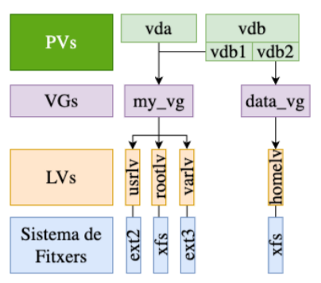

# AMSA – Setmana 7: Sistema de fitxers (part 3)

**Nom:** Nel Banqué Torné

---

## Resum teòric

### Introducció a LVM

**Logical Volume Manager (LVM)** és un sistema de gestió de discos que permet als administradors gestionar l’espai de disc de manera més flexible que amb les particions tradicionals, resolent problemes comuns.

#### Característiques de LVM

- **Aprovisionament:** permet combinar la capacitat de diferents dispositius físics per crear un únic o múltiples volums *virtuals*.
- **Elasticitat:** permet augmentar o disminuir l’espai assignat a un volum lògic sense necessitat de reiniciar el sistema.
- **Escalabilitat:** permet afegir o eliminar dispositius físics (com discs) al grup de volums per ampliar o reduir l’espai d’emmagatzematge segons les necessitats.
- **Resiliència:** atorga la capacitat de crear còpies de seguretat de les dades per protegir-les davant possibles errors o danys (*snapshots*).

#### Components de LVM

- **PV (Physical Volume):** dispositiu físic que es pot utilitzar per emmagatzemar dades (disc dur, partició, RAID...).
- **VG (Volume Group):** agrupació de PVs que proporciona una piscina d’espai per crear LVs.
- **LV (Logical Volume):** volum lògic creat dins d’un VG que pot contenir el seu propi sistema de fitxers.



#### Mapeig i extents

- **PE (Physical Extent):** unitat mínima d’emmagatzematge que es pot assignar a un PV (normalment 4M).
- **LE (Logical Extent):** unitat mínima d’emmagatzematge que es pot assignar a un LV.

#### Snapshots

Els *snapshots* són còpies instantànies d’un LV en un moment concret. El seu funcionament sol ser incremental: només es copien les dades que han canviat des de l’últim snapshot.

> Són útils per a còpies de seguretat i restauracions, però poden ocupar molt espai.

### LVM a Linux

En la majoria de les distribucions de Linux, el paquet `lvm2` permet la creació i gestió de dispositius LVM.

#### Creació de PVs

Comanda bàsica:

```bash
pvcreate PV [opcions]
```

On `PV` pot ser un disc dur, una partició, un dispositiu RAID, etc.

Opcions habituals:

- `--dataalignment mida[unitat]` — alinea el començament del PV.
- `--metadatasize mida[unitat]` — defineix la mida de les metadades.
- `--setphysicalvolumesize mida[unitat]` — estableix la mida del PV (ajusta PE/LE segons convé).
- `--uuid uuid` — assigna manualment un UUID al PV.
- `--longhelp` — mostra totes les opcions disponibles.

#### Organització interna dels PVs


#### Modificar PVs amb pvchange

Opcions útils:

```bash
pvchange [opcions] <PV>
```

- `--all` — aplica l’acció a tots els PVs.
- `--allocatable y|n` — activa/desactiva que el PV accepti nous extents (útil per treure un disc en manteniment).

Exemple:

```bash
pvchange --allocatable n /dev/sdb1
```

#### Redimensionar PVs amb pvresize

Opció clau:

```bash
pvresize --setphysicalvolumesize mida[unitat] <PV>
```

Punts importants:

- `pvresize` només ajusta l’espai LVM; abans cal redimensionar la partició o el dispositiu físic i el sistema de fitxers si cal.
- No es pot reduir un PV si hi ha extents assignades més enllà del nou final: moure o eliminar extents abans.
- Fer còpia de seguretat i comprovar estat (`vgdisplay`, `lvdisplay`) abans i després de l’operació.
- Evitar canvis amb LVs crítics actius sense proves prèvies.

#### Eliminar PVs amb pvremove

```bash
pvremove <dispositiu>
```

- `pvremove` elimina les metadades LVM del PV, però no esborra les dades del dispositiu.
- Requisits abans d'executar:
    - El PV no pot estar en ús: mou o elimina els extents (LVs) que hi utilitzen espai.
    - Si el PV forma part d'un VG, treu-lo del VG abans (`vgreduce`) o mou extents a altres PVs.

#### Visualitzar informació de PVs

Comandes útils:

- `pvs` — resum tabular dels PVs actius (útil per veure espai lliure i VG).
- `pvdisplay <PV>` — mostra informació detallada d'un PV.
- `pvscan` — escaneja dispositius per trobar PVs.

Nota: utilitza `pvs -o` per personalitzar columnes si cal.

#### Crear i configurar VGs (essencial)

```bash
vgcreate <VG> <PV1> [PV2 ...]
```

Opcions rellevants:

- `--physicalextentsize mida` — defineix la mida dels PE (ex. 4M).
- `--clustered y|n` — habilita l'ús del VG en clústers (si aplica).

Afegir i treure PVs:

- `vgextend <VG> <PV>` — afegeix un PV al VG.
- `vgreduce <VG> <PV>` — treu un PV del VG (o `vgreduce --removemissing` si falten PVs).

#### Crear LVs (essencial)

```bash
lvcreate -n <nom> -L <mida> <VG>
```

Opcions importants:

- `-n|--name` — nom del LV.
- `-L|--size` — mida (ex. 1G, 500M).
- `-l|--extents` — especificar amb extents si cal.
- `-s|--snapshot` — crear snapshot d'un LV.
- `-i|--stripes`, `-I|--stripesize` — per LVs amb striping (rendiment).
- `-m|--mirrors` — crear LV amb miralls (redundància).
- `-t|--thinpool` / thin LVs — per sobreaprovisionament (concepte bàsic).

Consells:

- Si no hi ha prou espai en el VG, primer `vgextend` (afegir PV) o esborrar/reduir LVs existents.
- Es pot controlar en quins PVs s’assignen extents per limitar l’assignació.

#### Consideracions pràctiques (resum)

- Sempre fer còpia de seguretat abans de modificar PV/VG/LV crítics.
- Per eliminar un PV utilitzat: moure extents amb `pvmove` → `vgreduce` → `pvremove`.
- Entendre PE/LE i la mida dels PE és important per planificar l'assignació d'espai.
- Thin pools i snapshots ofereixen flexibilitat però afegeixen complexitat: conèixer els conceptes bàsics és suficient per a l'examen.

Cas pràctic 01: LVM i bootloaders

- Recomanació general: deixar `/boot` o `/boot/efi` fora de LVM (partició estàtica) per simplificar la recuperació i la compatibilitat amb alguns bootloaders; LVM és recomanable per a `/`, `/home` i volums de dades.

---

## Exemples pràctics

### Cas pràctic 01: LVM i bootloaders

**Pregunta:** Es recomana posar `/boot` o `/boot/efi` dins de LVM?  
**Resposta:** No. Deixar `/boot` (o `/boot/efi`) en partició tradicional. Molts bootloaders no poden llegir LVM directament; el kernel i l’initramfs han d’estar accessibles a l’arrencada.

### Cas pràctic 02 (USB): dispositiu compartit entre Windows i Linux

**Pregunta:** Utilitzar LVM en un disc extern compartit físicament entre Windows i Linux?  
**Resposta:** No. LVM és específic de Linux i no és compatible amb Windows. Crear particions separades (ex. NTFS per Windows, ext4 per Linux) o usar un sistema de fitxers compartit compatible (ex. exFAT/NTFS) per dades comunes.

### Cas pràctic 02 (NAS): disc en un NAS amb recursos compartits en xarxa

**Pregunta:** Utilitzar LVM en un NAS per oferir volums per usuari?  
**Resposta:** Sí, pot ser útil. LVM facilita crear i redimensionar LVs per usuari i fer snapshots. Important: l'accés dels clients passa pel servei de xarxa (SMB/NFS), així que LVM és transparent als clients.

### Cas pràctic 03: servidor de base de dades (4 × 1TB)

**Pregunta:** Avantatges i inconvenients d’usar LVM?  
**Resposta:** Avantatges: striping per millorar I/O, snapshots per backups, ampliar discos sense aturades. Inconvenients: més complexitat i overhead, risc de pèrdua si el volum s’estén sobre discos sense redundància. Recomendació: combinar RAID (redundància/rendiment) amb LVM per flexibilitat.

### Cas pràctic 04: errors i fallades (PV1 falla)

**Pregunta:** Què passa amb metadades i snapshots si PV1 falla?  
**Resposta:** Depèn del que contenia PV1. Si tenia extents d’un LV, aquest LV pot quedar inaccesible o corromput (especialment si era striped). Si les metadades o snapshots estan en altres PVs, poden sobreviure; però la recuperació pot requerir backups o reconstruir metadades. Millors pràctiques: backups, distribuir snapshots/metadata, usar redundància (RAID).

### Cas pràctic 05: thin provisioning — beneficis, riscos i mitigació

**Pregunta:** Quan usar thin provisioning i com evitar problemes si s’omple l’espai?  
**Resposta:** Thin permet sobreprovisionar i guanyar flexibilitat amb pocs recursos inicials. Risc: escrits fallits quan la capacitat física s’acaba. Mitigacions: monitoratge i alertes d’espai, llindars automàtics, reserves de capacitat al thin pool, polítiques de quotes i pla per afegir discos/expandir VG abans d’arribar al límit.

(Fent servir LVM: sempre fer còpies de seguretat, provar en entorn no crític i preferir combinacions LVM+RAID quan cal redundància.)

---

## Dubtes, preguntes i aspectes interessants

- Un PV només pot pertànyer a un VG.  
- Un LV sempre pertany a un únic VG (no es pot compartir entre VGs).  
- Un VG pot contenir diversos PVs i diversos LVs.  
- Miralls (mirroring) requereixen espai addicional: per tolerància a fallada, col·loca les còpies en PVs diferents.  
- Els snapshots són copy‑on‑write i NO necessiten obligatòriament múltiples PVs, però sí espai lliure al VG o al thin pool; poden omplir‑se ràpidament.  
- Redimensionar un PV: primer redimensionar la partició o el dispositiu físic, després fer `pvresize`; no es pot reduir si hi ha extents actius més enllà del nou límit.  
- Thin pools: ofereixen sobreaprovisionament, però cal monitoritzar i configurar reserves/quotas per evitar errors d’escriptura quan s’omplen.  
- Comandes essencials per l’examen i diagnosi: `pvs`, `pvdisplay`, `pvscan`, `vgs`, `vgdisplay`, `lvs`, `lvdisplay`, `pvmove`, `vgextend`, `vgreduce`, `lvcreate`, `lvextend`.  
- Consells d’examen: explicar clarament la diferència entre `-L` (mida) i `-l` (extents), i quan usar `--allocatable`, `--physicalextentsize` o `--metadatasize`.  
- Bones pràctiques: deixar `/boot` (o `/boot/efi`) fora de LVM per compatibilitat d’arrencada; combinar LVM amb RAID per redundància i rendiment quan cal; provar canvis en entorn no crític.

---

## Reflexió personal

En aquesta setmana he après els conceptes clau de LVM (PV/VG/LV, PE/LE, snapshots i thin provisioning) i les seves aplicacions pràctiques. Valoro la flexibilitat que aporta per redimensionar i fer snapshots, però també els riscos i la complexitat: cal backups, monitoratge i, sovint, combinar amb RAID per redundància.